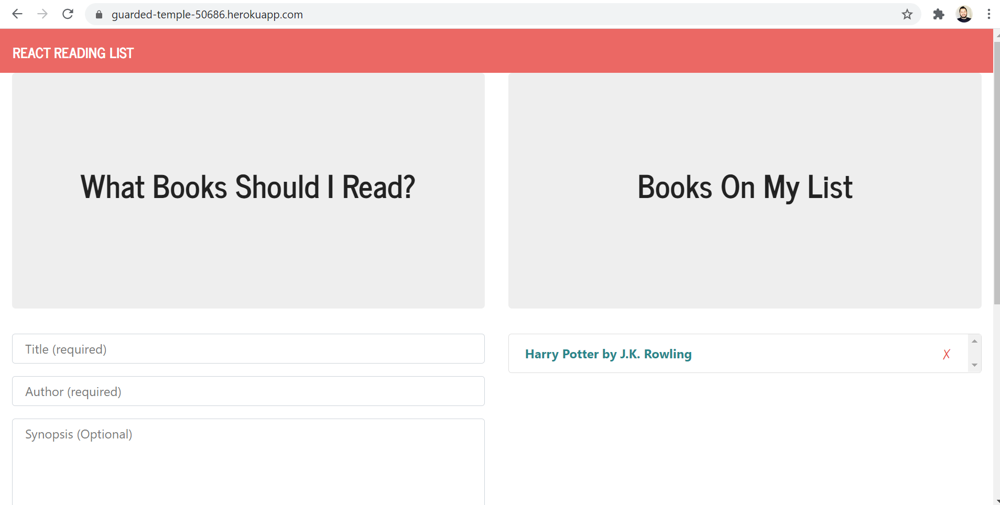
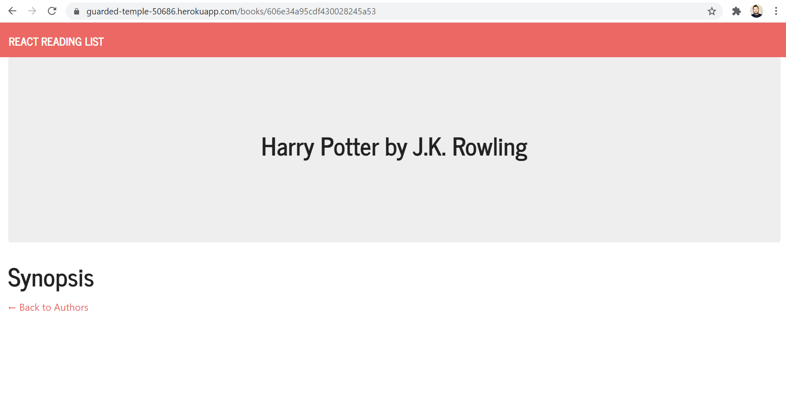

# Reading List

An application built to allow the user to add books to a list and to see the details of the books in another page.

## What the project does

The project is a full stack MERN application which allows the user to enter a title, an author, and a synopsis for each book. After the user enters the information and clicks the submit button, the information is saved to the database and the book is displayed on the user's list. The user can then click on any of the books to see the details of that particular book in another page. Below are screenshots of the two pages.

Note: the primary reason for creating a repository for this application was to go through the process of creating a repository and deploying a MERN application to Heroku.

Landing page

Details page

## Why is the project useful

The project was useful in helping me deploy a MERN application to Heroku. And as an application, it's useful to the users by allowing them to keep a list of any books they want to keep track of.

## How can users get started with the project

Simply navigate to the deployed version listed below to interact with it.

https://guarded-temple-50686.herokuapp.com/

## Where can users get help with your project

My GitHub username is: chavalk

Link: https://github.com/chavalk

If you have additional questions, feel free to reach me at chavalk@hotmail.com.

## Who maintains and contributes to the project

Currently I'm the only person maintaining and contributing to the project.